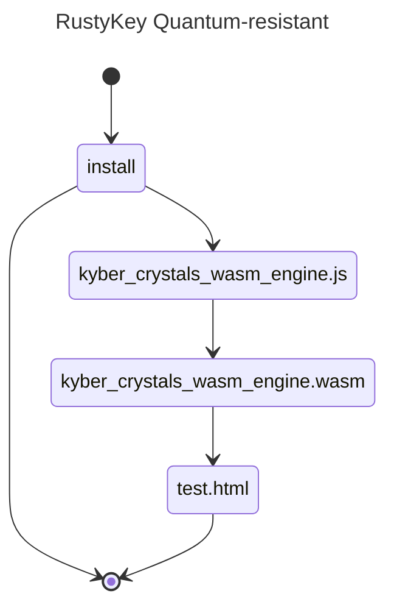

# c/c++ implementation mlKem

## How to Build on MacBook Pro M4 Max Sequoia with Homebrew package manager homebrew (see https://brew.sh)
### 1. Homebrew "formulae" (macOS packages)
- brew install emscripten
- brew install cmake

### 2. navigate to the directory above where you want the repo
- git clone https://github.com/antonymott/quantum-resistant-rustykey.git
- cd quantum-resistant-rustykey

### 3. locally recursively build the empty symlink folders libsodium and PQClean
- git submodule update --init --recursive

### 4. build
- emcmake cmake -Bbuild -DCMAKE_BUILD_TYPE=Release -DCMAKE_INSTALL_PREFIX=./install
- cmake --build build --target install
- cp ./install/kyber_crystals_wasm_engine.wasm ./src/

```
\install
|-kyber_crystals_wasm_engine.js
|-kyber_crystals_wasm_engine.wasm
|-test.html
```

### 5. enjoy!
- open install/test.html in live server
- open dev tools -> console to view encrypt decrypt of the three variants


