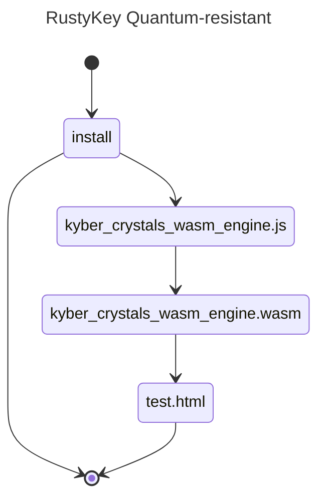

# quantum-resistant-rustykey
## kyber wasm implementation conveniently wrapped in es6 module
- improved version of NIST winner's standard implementation, patched to withstand some side-channel attacks, see here: [***raspberryPi recovers secret keys from NIST winner implementation...within minutes***](https://kannwischer.eu/papers/2024_kyberslash_preprint20240628.pdf)


## 🚧 WORK IN PROGRESS...do not install 🚧
## tested front end and backend ONLY to work node v23.10.0
- NOT tested for Bun or earlier node versions
- feel free to contribute tested pull requests to include earlier node versions or for Bun

A WASM implementation of "Cryptographic Suite for Algebraic Lattices" (CRYSTALS) based on hard problems over module lattices, designed to withstand attacks by large quantum computers, and selected among the winners of the [NIST post-quantum cryptography project](https://pq-crystals.org/index.shtml)

| package           | registry                                                                                                                  | description                                                                                                                                                                                                                          |
| ----------------- | ------------------------------------------------------------------------------------------------------------------------- | ------------------------------------------------------------------------------------------------------------------------------------------------------------------------------------------------------------------------------------ |
| quantum-resistant-rustykey | [](https://www.npmjs.com/package/quantum-resistant-rustykeyy) |  🚧 WORK IN PROGRESS 🚧      |


<div align="left">
For Node.js, you can install quantum-resistant-rustykey via pnpm, npm or yarn:

```sh
pnpm install quantum-resistant-rustykey
```

Use:

```typescript
import { rustykey1024, rustykey768, rustykey512 } from "quantum-resistant-rustykey";

async function doRustykey() {
  const keypair = rustykey1024.keypair()
  const public_key = rustykey1024.buffer_to_string(keypair.get('public_key'))
  const private_key = rustykey1024.buffer_to_string(keypair.get('private_key'))
  console.log("public_key:", public_key)
  console.log("private_key:", private_key)

  const encrypt = rustykey1024.encrypt(keypair.get('public_key'))
  console.log("cyphertext: ", rustykey1024.buffer_to_string(encrypt.get('cyphertext')))
  console.log("secret: ", rustykey1024.buffer_to_string(encrypt.get('secret')))

  const secret = rustykey1024.decrypt(encrypt.get('cyphertext'), keypair.get('private_key'))
  console.log("secret: ", rustykey1024.buffer_to_string(secret))

  return
}

try {
  doRustykey()
} catch (err: unknown) {
  console.log("failed:", (err as Error).message)
}
```

## Index

- [Installation](#installation)
  - [Node.js](#nodejs)
- [Usage](#usage)
- [Contributing](#contributing)

## Installation

### Node.js

```sh
pnpm install quantum-resistant-rustykey
npm install quantum-resistant-rustykey
yarn add quantum-resistant-rustykey
```

# compliance testing: build and test from source on your own machine

## Only tested to build on MacBook Pro M4 Max Sequoia with Homebrew package manager homebrew (see https://brew.sh)
### 1. Homebrew "formulae" (macOS packages)
- brew install emscripten
- brew install cmake

### 2. navigate to the directory above where you want the repo
- git clone https://github.com/antonymott/quantum-resistant-rustykey.git
- cd quantum-resistant-rustykey

### 3. locally recursively build the empty symlink folders libsodium and PQClean
- git submodule update --init --recursive

### 4. build
- emcmake cmake -Bbuild -DCMAKE_BUILD_TYPE=Release -DCMAKE_INSTALL_PREFIX=./install
- cmake --build build --target install
- cp install/kyber_crystals_wasm_engine.wasm ./src/

```
\install
|-kyber_crystals_wasm_engine.js
|-kyber_crystals_wasm_engine.wasm
|-test.html
```

### 5. enjoy!
- open install/test.html in live server
- open dev tools -> console to view encrypt decrypt of the three variants


### 6. build for standalone .js (.ts) in main thread wrapped in a js worker
- copy how the developers achieved this with [sqlite-wasm](https://github.com/sqlite/sqlite-wasm)
