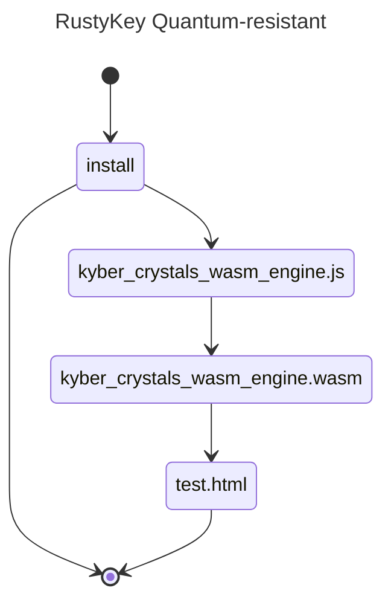

# quantum-resistant-rustykey

## 🚧 WORK IN PROGRESS...do not install 🚧
## tested front end and backend ONLY to work node v23.10.0
- NOT tested for Bun or earlier node versions
- feel free to contribute tested pull requests to include earlier node versions or for Bun

A WASM implementation of "Cryptographic Suite for Algebraic Lattices" (CRYSTALS) encompasses two cryptographic primitives: Kyber, an IND-CCA2-secure key-encapsulation mechanism (KEM); and Dilithium, a strongly EUF-CMA-secure digital signature algorithm. Both algorithms are based on hard problems over module lattices, are designed to withstand attacks by large quantum computers, and were selected among the winners of the [NIST post-quantum cryptography project](https://pq-crystals.org/index.shtml)

| package           | registry                                                                                                                  | description                                                                                                                                                                                                                          |
| ----------------- | ------------------------------------------------------------------------------------------------------------------------- | ------------------------------------------------------------------------------------------------------------------------------------------------------------------------------------------------------------------------------------ |
| quantum-resistant-rustykey | [](https://www.npmjs.com/package/quantum-resistant-rustykeyy) |  🚧 WORK IN PROGRESS 🚧      |


<div align="left">
For Node.js, you can install quantum-resistant-rustykey via pnpm, npm or yarn:

```sh
pnpm install quantum-resistant-rustykey
```

Use:

```typescript
import { MlKem768 } from "crystals-kyber-rustykey";

async function doMlKem() {
  // A recipient generates a key pair.
  const recipient = new MlKem768(); // MlKem512 and MlKem1024 are also available.
  const [pkR, skR] = await recipient.generateKeyPair();
  //// Deterministic key generation is also supported
  // const seed = new Uint8Array(64);
  // globalThis.crypto.getRandomValues(seed); // node >= 19
  // const [pkR, skR] = await recipient.deriveKeyPair(seed);

  // A sender generates a ciphertext and a shared secret with pkR.
  const sender = new MlKem768();
  const [ct, ssS] = await sender.encap(pkR);

  // The recipient decapsulates the ciphertext and generates the same shared secret with skR.
  const ssR = await recipient.decap(ct, skR);

  // ssS === ssR
  return;
}

try {
  doMlKem();
} catch (err: unknown) {
  console.log("failed:", (err as Error).message);
}
```

## Index

- [Installation](#installation)
  - [Node.js](#nodejs)
- [Usage](#usage)
- [Contributing](#contributing)

## Installation

### Node.js

```sh
pnpm install quantum-resistant-rustykey
npm install quantum-resistant-rustykey
yarn add quantum-resistant-rustykey
```

# compliance testing: build and test from source on your own machine

## Only tested to build on MacBook Pro M4 Max Sequoia with Homebrew package manager homebrew (see https://brew.sh)
### 1. Homebrew "formulae" (macOS packages)
- brew install emscripten
- brew install cmake

### 2. navigate to the directory above where you want the repo
- git clone https://github.com/antonymott/quantum-resistant-rustykey.git
- cd quantum-resistant-rustykey

### 3. locally recursively build the empty symlink folders libsodium and PQClean
- git submodule update --init --recursive

### 4. build
- emcmake cmake -Bbuild -DCMAKE_BUILD_TYPE=Release -DCMAKE_INSTALL_PREFIX=./install
- cmake --build build --target install
- cp install/kyber_crystals_wasm_engine.wasm ./src/

```
\install
|-kyber_crystals_wasm_engine.js
|-kyber_crystals_wasm_engine.wasm
|-test.html
```

### 5. enjoy!
- open install/test.html in live server
- open dev tools -> console to view encrypt decrypt of the three variants


