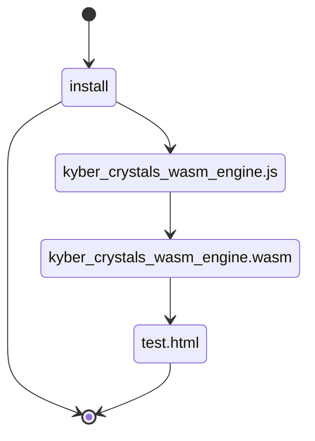

**Note**: 🚧 WORK IN PROGRESS...do not install 🚧

# Quantum-Resistant RustyKey

A WebAssembly implementation of ML-KEM (Quantum-Resistant Signatures) for both Node.js and web environments. This is an improved version of the NIST winner's standard implementation, patched to withstand side-channel attacks.

<!-- > **Note**: 🚧 WORK IN PROGRESS...do not install 🚧 -->
<p align="center">
  
</p>


## About

A WASM implementation of "Cryptographic Suite for Algebraic Lattices" (CRYSTALS) based on hard problems over module lattices, designed to withstand attacks by large quantum computers, and selected among the winners of the [NIST post-quantum cryptography project](https://pq-crystals.org/index.shtml)

| Package | Registry | Description |
|---------|----------|-------------|
| quantum-resistant-rustykey | [](https://www.npmjs.com/package/quantum-resistant-rustykey) | 🚧 WORK IN PROGRESS 🚧 |

## Installation

For Node.js, you can install quantum-resistant-rustykey via pnpm, npm or yarn:

```bash
pnpm install quantum-resistant-rustykey
# or
npm install quantum-resistant-rustykey
# or
yarn add quantum-resistant-rustykey
```

## Usage

### Node.js Environment

```typescript
import { loadMlKem1024, loadMlKem768, loadMlKem512 } from "quantum-resistant-rustykey";

async function main() {
  try {
    // Load the desired ML-KEM variant
    const mlkem = await loadMlKem1024(); // Options: loadMlKem1024, loadMlKem768, loadMlKem512

    // Generate key pair
    const keypair = mlkem.keypair();
    const publicKey = mlkem.buffer_to_string(keypair.get('public_key'));
    const privateKey = mlkem.buffer_to_string(keypair.get('private_key'));
    console.log("Public Key:", publicKey);
    console.log("Private Key:", privateKey);

    // Encrypt a message
    const message = "Hello, quantum-resistant world!";
    const encrypt = mlkem.encrypt(keypair.get('public_key'));
    const ciphertext = mlkem.buffer_to_string(encrypt.get('cyphertext'));
    const secret = mlkem.buffer_to_string(encrypt.get('secret'));
    console.log("Ciphertext:", ciphertext);
    console.log("Secret:", secret);

    // Decrypt the message
    const decrypted = mlkem.decrypt(encrypt.get('cyphertext'), keypair.get('private_key'));
    console.log("Decrypted:", mlkem.buffer_to_string(decrypted));
  } catch (error) {
    console.error("Error:", error);
  }
}

main();
```

### Web Environment

```typescript
import { loadMlKem1024, loadMlKem768, loadMlKem512 } from 'quantum-resistant-rustykey';

// Example usage in a web application
async function handleEncryption() {
  try {
    // Load the desired ML-KEM variant
    const mlkem = await loadMlKem1024(); // Options: loadMlKem1024, loadMlKem768, loadMlKem512
    
    // Generate key pair
    const keypair = mlkem.keypair();
    const publicKey = mlkem.buffer_to_string(keypair.get('public_key'));
    const privateKey = mlkem.buffer_to_string(keypair.get('private_key'));
    
    // Store keys securely (e.g., in IndexedDB or secure storage)
    await storeKeys(publicKey, privateKey);

    // Encrypt user data
    const userData = {
      username: "user123",
      email: "user@example.com"
    };
    
    const encrypt = mlkem.encrypt(keypair.get('public_key'));
    const ciphertext = mlkem.buffer_to_string(encrypt.get('cyphertext'));
    const secret = mlkem.buffer_to_string(encrypt.get('secret'));

    // Send encrypted data to server
    await sendToServer(ciphertext, secret);
  } catch (error) {
    console.error("Encryption error:", error);
  }
}

// Example secure storage implementation
async function storeKeys(publicKey: string, privateKey: string) {
  // Implement secure storage (e.g., IndexedDB, Web Crypto API)
  // This is just a placeholder - implement proper secure storage
  localStorage.setItem('mlkem_publicKey', publicKey);
  localStorage.setItem('mlkem_privateKey', privateKey);
}

// Example server communication
async function sendToServer(ciphertext: string, secret: string) {
  // Implement server communication
  // This is just a placeholder - implement proper API calls
  const response = await fetch('/api/secure-data', {
    method: 'POST',
    headers: {
      'Content-Type': 'application/json',
    },
    body: JSON.stringify({ ciphertext, secret }),
  });
  return response.json();
}

// Initialize the application
document.addEventListener('DOMContentLoaded', () => {
  const encryptButton = document.getElementById('encrypt-button');
  if (encryptButton) {
    encryptButton.addEventListener('click', handleEncryption);
  }
});
```

### Security Considerations for Web Usage

When using ML-KEM in a web environment, consider the following security best practices:

1. **Key Storage**:
   - Never store private keys in localStorage or sessionStorage
   - Use secure storage mechanisms like IndexedDB with encryption
   - Consider using the Web Crypto API for additional security

2. **Key Management**:
   - Generate new key pairs for each session when possible
   - Implement proper key rotation policies
   - Consider using a key management service for production applications

3. **Data Handling**:
   - Always encrypt sensitive data before transmission
   - Use HTTPS for all communications
   - Implement proper error handling to prevent information leakage

4. **Performance**:
   - Consider using Web Workers for cryptographic operations
   - Implement proper loading states for long-running operations
   - Cache public keys when appropriate

## Building from Source

### Prerequisites

- Node.js >= 18
- npm
- Emscripten
- CMake

### Build Instructions

1. Clone the repository:
```bash
git clone https://github.com/antonymott/quantum-resistant-rustykey.git
cd quantum-resistant-rustykey
```

2. Initialize submodules:
```bash
git submodule update --init --recursive
```

3. Install dependencies:
```bash
npm install
```

4. Build the package:

### Environment Configuration

The package supports two different environments:

- **Web Environment**: Set `sENVIRONMENT=web,worker` in CMakeLists.txt
- **Node.js Environment**: Set `sENVIRONMENT=node,worker` in CMakeLists.txt

```bash
npm run build

# Copy the WASM file to src directory
cp install/kyber_crystals_wasm_engine.wasm ./src/
```

The `sENVIRONMENT` option specifies which environments the WebAssembly module should be built for:
- `web`: Enables running in web browsers
- `worker`: Enables running in Web Workers
- `node`: Enables running in Node.js

For web applications, use `web,worker` to support both browser and Web Worker environments.
For Node.js applications, use `node,worker` to support both Node.js and Worker Threads.

The build process consists of two main steps:
1. `prebuild`: Builds the WASM engine using Emscripten and CMake
2. `build`: Compiles TypeScript files to JavaScript


## Testing

- Tested to work with Node.js v23.10.0
- For web testing, open `install/test.html` in a live server and check the console for encryption/decryption results of the three variants

## Project Structure



## Publishing

The package is published from the `install` folder. To publish a new version:

1. Update the version in `package.json`
2. Run the build process
3. Publish to npm:
```bash
npm publish
```

## Security Considerations

This implementation includes patches to withstand side-channel attacks. For more information about the security improvements, see: [RaspberryPi recovers secret keys from NIST winner implementation...within minutes](https://kannwischer.eu/papers/2024_kyberslash_preprint20240628.pdf)

## Contributing

- Please make pull requests tested to work on Bun and previous Node.js versions
- Follow the existing code style and testing practices
- Include tests for new features
- Update documentation as needed

## License

ISC

## Acknowledgments

- Based on the NIST post-quantum cryptography project
- Inspired by the implementation approach of [sqlite-wasm](https://github.com/sqlite/sqlite-wasm)
