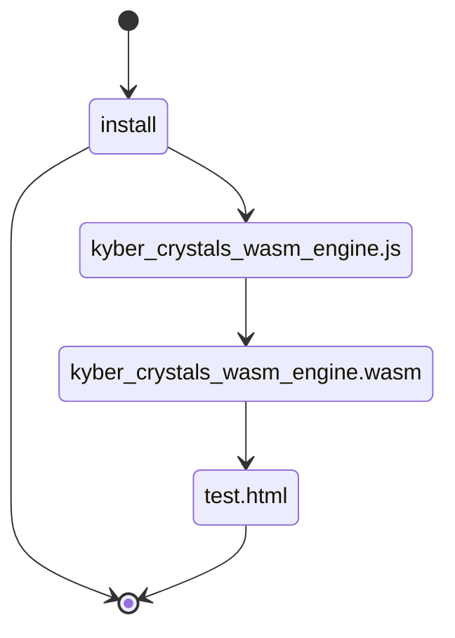

**Note**: 🚧 WORK IN PROGRESS...do not pnpm install 🚧

# Quantum-Resistant RustyKey®

A WebAssembly implementation of ML-KEM (Quantum-Resistant Signatures) for both Node.js and web environments. This is an improved version of the NIST winner's standard implementation, patched to withstand side-channel attacks.

<!-- > **Note**: 🚧 WORK IN PROGRESS...do not install 🚧 -->
<p align="center">
  
</p>


## About
You use this quantum-resistant RustyKey® npm package mainly for secure key exchange, specifically as a Key Encapsulation Mechanism (KEM). It's designed to securely establish a shared secret between two parties, which is then used for encryption with a symmetric algorithm like AES. While Kyber can be used for encryption, its primary function is to encapsulate and transmit a session key, not the data itself. 

Here's a more detailed explanation:
Key Exchange (KEM):
- to facilitate the secure exchange of a shared secret key between two parties. This shared key is then used to encrypt and decrypt data using a separate, symmetric encryption algorithm. 
Not Direct Encryption:
- doesn't directly encrypt the data itself. It's designed to securely encapsulate a session key, which is then used to encrypt the actual data using a symmetric encryption algorithm. 
Hybrid Approach:
- often used in a hybrid approach, combining it with symmetric encryption algorithms like AES for stronger security. Used to securely exchange a session key, then used to encrypt the data using AES. 
Post-Quantum Security:
- a post-quantum cryptosystem, meaning it is designed to be secure against attacks from quantum computers. This makes it a valuable tool for securing communication in the future when quantum computers become more powerful. 

In essence, RustyKey® quantum-resistant npm package creates a secure handshake, establishing a shared secret key that can then be used to encrypt and decrypt data with a more efficient symmetric encryption algorithm

## Web Assembly implementation
### Pros
#### Highly secure
Wasm operates within a sandboxed environment, isolating it from the host system. This prevents malicious code within the Wasm module from directly accessing sensitive data or compromising system resources. JavaScript, while also sandboxed, has a larger attack surface due to its dynamic nature and access to a wider range of APIs.
#### Reduced Attack Surface
Since Wasm modules have limited access to system resources and APIs, their attack surface is smaller than that of JavaScript. This makes it more difficult for attackers to exploit vulnerabilities.
#### fast
(mostly!) as Web Assembly (WASM) implementations of algorithms offer near-native performance due to WASM's low-level of bytecode, which itself is usually orders of magnitude faster than JavaScript for computationally intensive tasks.
#### Controlled Imports
Wasm modules have explicit import declarations, defining the exact functions they can access from the host environment (usually JavaScript). This allows for fine-grained control over the module's capabilities. In contrast, JavaScript has more implicit access to APIs, making it harder to restrict its behavior.
#### Static Analysis
Wasm's binary format allows for static analysis and code validation. This enables browsers to verify the module's structure and behavior before execution, reducing the risk of introducing vulnerabilities. JavaScript, being dynamically typed and interpreted, is more challenging to analyze statically.
#### Compilation and Validation
Wasm code is compiled into a low-level bytecode that is validated before execution. This process helps to identify and prevent many types of vulnerabilities that are common in JavaScript, such as buffer overflows.

### Cons
#### Complex
WASM is more complex to work with than JavaScript, and requires a build process to compile code into WASM modules and manual memory management, which is why this package exists...to make it easier for developers and end-users to incorporate the benefits of increased security and faster speed into their authentication, authorization and other encryption/decryption workflows.

#### No Direct DOM Access
WASM cannot directly manipulate the DOM. It relies on JavaScript to interact with the DOM, which adds complexity and can affect performance when frequent DOM interactions are needed.
#### Garbage Collection
WASM relies on JavaScript for garbage collection, which can be less efficient compared to languages with native garbage collection.
#### Limited API Access
WASM has limited access to browser and Node.js APIs compared to JavaScript, requiring JavaScript to act as a bridge for these interactions.
#### Data Transfer Overhead
Passing data between WASM and JavaScript can incur performance overhead due to serialization and deserialization.

### Algorithm source
Based on a suite of "Cryptographic Suite for Algebraic Lattices" (CRYSTALS) based on hard problems over module lattices, designed to withstand attacks by large quantum computers, and selected among the winners of the [NIST post-quantum cryptography project](https://pq-crystals.org/index.shtml)

| Package | Registry | Description |
|---------|----------|-------------|
| quantum-resistant-rustykey | [](https://www.npmjs.com/package/quantum-resistant-rustykey) | 🚧 WORK IN PROGRESS 🚧 |

## Installation

For Node.js, you can install quantum-resistant-rustykey via pnpm, npm or yarn:

```bash
pnpm install quantum-resistant-rustykey
# or
npm install quantum-resistant-rustykey
# or
yarn add quantum-resistant-rustykey
```

## Usage

### Node.js Environment

```typescript
import { loadMlKem1024, loadMlKem768, loadMlKem512 } from "quantum-resistant-rustykey";

async function main() {
  try {
    // Load the desired ML-KEM variant
    const mlkem = await loadMlKem1024(); // Options: loadMlKem1024, loadMlKem768, loadMlKem512

    // Generate key pair
    const keypair = mlkem.keypair();
    const publicKey = mlkem.buffer_to_string(keypair.get('public_key'));
    const privateKey = mlkem.buffer_to_string(keypair.get('private_key'));
    console.log("Public Key:", publicKey);
    console.log("Private Key:", privateKey);

    // Encrypt a message
    const message = "Hello, this is a secret message!";
    var encrypt = mlkem.encrypt(keypair.get('public_key'))
    const sharedSecret = encrypt.get('secret')
    const encryptedMessage = await mlkem.encryptMessage(message, sharedSecret)
    console.log("Encrypted message: ", encryptedMessage)

    // Decrypt the message
    var decryptedSharedSecret = mlkem.decrypt(encrypt.get('cyphertext'), keypair.get('private_key'))
    const decryptedMessage = await mlkem.decryptMessage(encryptedMessage, decryptedSharedSecret)
    console.log("Decrypted message: ", decryptedMessage)
  } catch (error) {
    console.error("Error:", error);
  }
}

main();
```

### Security Considerations for Web Usage

When using ML-KEM in a web environment, consider the following security best practices:

1. **Key Storage**:
   - Never store private keys in localStorage or sessionStorage
   - Use secure storage mechanisms like IndexedDB with encryption
   - Consider using the Web Crypto API for additional security

2. **Key Management**:
   - Generate new key pairs for each session when possible
   - Implement proper key rotation policies
   - Consider using a key management service for production applications

3. **Data Handling**:
   - Always encrypt sensitive data before transmission
   - Use HTTPS for all communications
   - Implement proper error handling to prevent information leakage

4. **Performance**:
   - Consider using Web Workers for cryptographic operations
   - Implement proper loading states for long-running operations
   - Cache public keys when appropriate

## Building from Source

### Prerequisites

- Node.js >= 23.6.0 (optimal)
- Node.js >= 22 (current LTS)
- pnpm (pnpm for faster cache, but npm also works fine)
- Emscripten
- CMake

### Build Instructions

1. Clone the repository:
```bash
git clone https://github.com/antonymott/quantum-resistant-rustykey.git
cd quantum-resistant-rustykey
```

2. Initialize submodules:
```bash
git submodule update --init --recursive
```

3. Install dependencies:
```bash
pnpm i
```

4. Build the WASM engine with Emscripten and CMake

### Environment Configuration

The package supports two different environments:

- **Web Environment**: Set `sENVIRONMENT=web,worker` in CMakeLists.txt
- **Node.js Environment**: Set `sENVIRONMENT=node,worker` in CMakeLists.txt

```bash
pnpm pre

# Copy the WASM file to src directory
cp install/kyber_crystals_wasm_engine.wasm ./src/
```

The `sENVIRONMENT` option specifies which environments the WebAssembly module should be built for:
- `web`: Enables running in web browsers
- `worker`: Enables running in Web Workers
- `node`: Enables running in Node.js

For web applications, use `web,worker` to support both browser and Web Worker environments.
For Node.js applications, use `node,worker` to support both Node.js and Worker Threads.

5. Compile TypeScript files to JavaScript

```bash
pnpm build
```


## Testing

- Tested to work with Node.js v23.6.0
- For web testing, open `install/test.html` in a live server and check the console for encryption/decryption results of the three variants

## Project Structure



## Publishing

The package is published from the `install` folder. To publish a new version:
1. make a new branch locally from main
2. edit and test your changes
3. pnpm changeset
4. build (will run CI/CD tests)
5. if it works, CI/CD will generate a pull request for admin to approve

## Security Considerations

This implementation includes patches to withstand side-channel attacks. For more information about the security improvements, see: [RaspberryPi recovers secret keys from NIST winner implementation...within minutes](https://kannwischer.eu/papers/2024_kyberslash_preprint20240628.pdf)

## Contributing

- Please make pull requests tested to work on Bun and previous Node.js versions
- Follow the existing code style and testing practices
- Include tests for new features
- Update documentation as needed

## License

ISC

## Acknowledgments

- Based on the NIST post-quantum cryptography project
- Inspired by the implementation approach of [sqlite-wasm](https://github.com/sqlite/sqlite-wasm)
